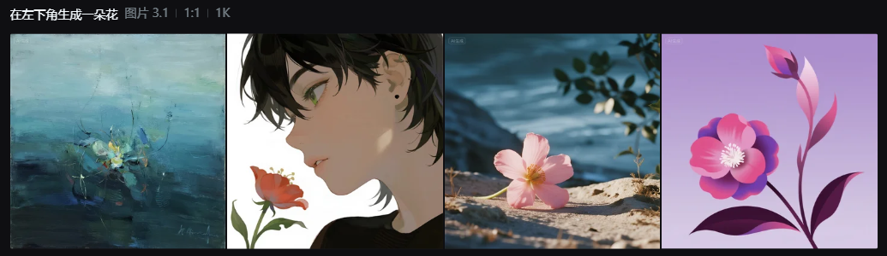

# Thought and Draw
---------------------
## 前言
在前一段时间玩Stable Diffusion时，我发现这种sd架构的多模态模型其实对于语言的理解能力并不好（传统的sd xl模型甚至要把语言描述浓缩为一个一个独立的词，flux模型稍好一些，但依然不能通过语言精确地控制图像的生成）。


我觉得，其根本原因应该是sd架构利用文本编码器（一般是clip，产生77*768维度）（77个词太小了，就算分组叠加取平均，还是破坏了深层语义）所生成的向量，只是简单的用cross-attention将文本向量与图片向量相融合，这样势必会导致以下三种结果：

1. 模型将这77个文本embedding相互独立看待，所以生成的要去除的噪声图像就只是趋近于这77个词的语义空间，那么就会导致文本prompt变成一个一个词才是最适配模型的。（现状）

2. 模型需要近乎咒语般的prompt和随机数种子，才能随机出一个想要的样子，但这本质上只是撞大运，而不是精确的上下文控制。（现状）
3. 模型在这有限长度的文本上下文中，只靠一个cross-attention就幸运的成功学到了精确的细节控制（词语此之间的相互语义，例如“在左下角生成一朵花”）。（我觉得不太可能，应该要**附加更深的结构（本文间的自注意力）、更大的上下文**）（话说gpt-4o貌似不错，不知道是不是改成我想的纯transformer结构了）

总而言之，现在的sd架构缺少真正的上下文控制方法，虽然不排除继续在sd架构上魔改、打补丁也能修复这一问题，但我想提出一个新的思路：

## 直接用纯transformer架构，混合生成文本和图像
### 思路
已有的vit的方法是把图片分割成一块一块的patch，再进transformer层获得该patch的embedding，这种方法适合于图像理解，但在做图像生成时却不自然且困难重重。（图像转embedding容易，但embedding转图像却很难（又回到了sd的老路））

那么我们有没有什么能够把图像和文本做无损双向映射的办法呢？（这样就可以同时做到生成和理解）

办法当然有，既然在后期做语义的映射有困难，那我们干脆在进入模型前就把图片给token化。

该方法往抽象了说就是**“万物皆可被token”“图像token也是一种新语言”**。（不知道多模态领域有没有人提出来过）但我的思路启发是来自李沐大神最新发布的[AudioLLM](https://github.com/boson-ai/higgs-audio)，李沐的语音大模型思路是把音频切分成很短的片段，再把每个片段映射到一个最接近的音素上，这样就可以把这些音素给token化，并加入词表中，进而完成音频和文字的混合输入输出。

那我们的思路也是类似，把像素给token化，进而完成图像和文字的混合输入输出，最后再接个vae做高分辨率。

至于分辨率高带来的输出像素太多，超长的问题，我的思路是：
1. 现在大模型的上下文已经可以很长了。
2. 其实LLM输出的图像并不需要太大，可以只输出低分辨率图像，然后交给超分模块解决。
3. 其实既然都已经上LLM了，那何不让模型也加入思考过程，进行分层、分块的图像输出？

### 验证实验
#### 方法
用qwen3-8B，生成32*32大小的灰度图，把0-255的灰度色阶作为特殊token加入qwen3-8B的词表中，然后进行lora微调，使得qwen3-8B可以将文字和图片混合输出。

#### token
由于qwen3的词表中本来就有"<|vision_start|>"和"<|vision_end|>"，所以我们只需要补充像素token即可：
```python
from transformers import AutoTokenizer, AutoModelForCausalLM

# 新增特殊标记
SPECIAL_TOKENS = {
    **{f"[PX{i}]": f"[PX{i}]" for i in range(256)}  # 灰度像素标记
}

tokenizer = AutoTokenizer.from_pretrained("Qwen/Qwen3-8B")
tokenizer.add_special_tokens({'additional_special_tokens': list(SPECIAL_TOKENS.values())})
model = AutoModelForCausalLM.from_pretrained("Qwen/Qwen3-8B")
model.resize_token_embeddings(len(tokenizer))
```

```python
from PIL import Image
import numpy as np

def process_image(image_path):
    img = Image.open(image_path).convert('L').resize((32, 32))
    pixels = np.array(img).flatten()  # 转为1024个灰度值
    return pixels

def image_to_token_sequence(pixels):
    """将像素值转换为token ID序列"""
    pixel_tokens = [tokenizer.convert_tokens_to_ids(f"[PX{int(p)}]") for p in pixels]
    return pixel_tokens
```

#### 数据
验证实验先按简单的来，使用MNIST、CIFAR-10等标准数据集，将图像转换为32×32灰度图，并为每张图像生成简单的指令描述。
数据格式示例：
```text
用户: 请画一个太阳
模型: <think>用户要求画一个太阳。太阳是一个明亮的圆形天体，为地球提供光和热。首先需要生成一个圆形的太阳图像，然后再添加一些射线表示光芒。</think>
好的，这是一个简单的太阳图像：<|Image|>[PX0][PX0]...[PX255]...[PX0]</|Image|>
```
具体的思考过程描述我可以让qwen-vl生成。

---------------------

## TODO

- [ ] 分块/分层，thought并生成该块图像，理论上可以有更好效果及更大分辨率
